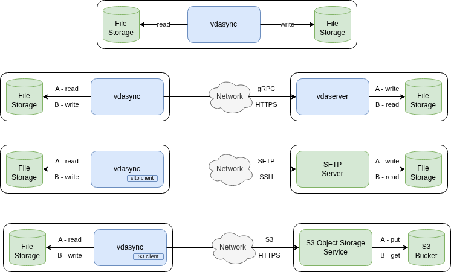

# vdasync

Vdasync is a versatile data access and synchronization tool. Synchronization leverages concurrency and may be very fast.

It provides access to files or data, either local or remote, through a CLI and a simple API.

The CLI main use is to synchronize data among different locations, for instance for data backup and restore or replication.

Beyond local and remote files access, various data access means may be implemented through the use of plugins.
The tool provides the following plugins:

- object storage through an S3 API,
taking care of OS files attributes (type, permissions and modification time)
- remote files access over SFTP
- client-side encrypted storage over local or remote storage

## Vdasync's components

- `vdasync` CLI for synchronization
- `vdaserver` gRPC server for remote access
- [go API](dssa/dssa.go) and [gRPC API](grpc/dssa.proto)
- plugins
  - `vdas3` S3 storage plugin with simple OS files attributes management
  - `vdasftp` SFTP client
  - `vdaencrypt` client-side encryption
- Utility to generate testing TLS certificates for CAs, clients and servers

The schema below explains how vdasync's components in blue interact
and integrate with infrastructure in green. Source may be either on left (A - flows) or on right (B - flows).

## Basic usage

Utilities arguments meaning are displayed using `<cli-command> -help`.

CLI tools access data through DSS, DSS stands for data storage system:
this can refer either simply to local files, to remote files accessed on a host running `vdaserver`,
or else to a plugin configured through a file as explained in [details page](docs/detailed_usage.md).

Communications with remote servers or plugins use mTLS, security may be lowered or disabled,
using self-generated certificates or HTTP without TLS.
Such settings are disabled by default and should only be used when understanding the risks.

### `vdasync` utility

`vdasync` **concurrency** is disabled by default, but increasing it is generally recommended
to gain better performance, as explained later.

`vdasync`, and its plugins if applicable, are **logging** information in `$TMPDIR` files by default.
This may be configured as detailed on [this page](docs/detailed_usage.md).

Basic usage is

    vdasync [-dryrun] [-rm] [-check] -source <source DSS> -target <target DSS>

Source and target directories must exist in the case of files, their respective sub-trees will be synchronized.

For instance

    vdasync -dryrun -rm -source /path/to/dev -target /path/to/backup/for/dev
    vdasync -rm -source /path/to/dev -target /path/to/backup/for/dev
    vdasync -dryrun -check -source /path/to/dev -target /path/to/backup/for/dev

Remote access to a `vdaserver` (see [details](docs/detailed_usage.md) page)
would be enabled with the following DSS syntax:

    dss://<server>:<port>/path/to/remote

For instance restoring local files from a remote backup:

    vdasync -rm -source dss://backup-server:9443/path/to/backup -target /path/to/dev

Using a plugin is enabled through a configuration file, for instance:

    # file /path/to/s3Config.yaml
    plugins:
    - name: s3-test
      type: vdas3
      addArgs:
      - "-s3profile"
      - test-profile
      - "-s3bucket"
      - test-bucket
      - "-s3prefix"
      - vdasync/tests/backup/dev

The data served by the plugin is accessed through its name, for instance making a backup to S3 object storage:

    vdasync -conc 16 -rm -source /path/to/dev -target s3-test+dss:/ -config /path/to/s3Config.yaml

This will automatically run the `vdas3` executable plugin, provided as the plugin type above,
with the "-s3*" arguments provided in the same file,
here enabling up to 16 concurrent I/O requests to reduce the effect of S3 service and network latency.

It should be noted that omitting the `//<server>:<port>` part in the DSS URL means accessing `localhost`
on a dynamically allocated TCP port, which is generally what is wanted for a plugin.
Concerning the `path` part in the URL, it is set to "/" in the case of S3,
as the prefix to use in the bucket is provided with the "-s3prefix" argument given in the configuration.
Further details about the `vdas3` plugin are provided on the [details](docs/detailed_usage.md) page.

### Use of concurrency

As said above, increasing `vdasync` concurrency is generally recommended to gain better performance.
Its setting depends on the infrastructure and the plugins involved.

- As a default, the number of available CPU cores can be provided in many cases.
- Writing to slow devices should reduce it or even disable it (USB stick),
as parallel writes may even become counterproductive.
- Access to remote resources must take care of the target service capacity
that is often shared between many users.
- Using S3 and other HTTP-based services often benefits increasing it because related requests
involve network latency but may be run safely in parallel;
nevertheless this must be balanced with shared resources usage.
- Same remark applies in the case of network based storage like NFS or NAS.
- Client based encryption requires local compute resources,
therefore concurrency will be tuned according to related capacity.

### Detailed usage

Detailed documentation for using vdasync's components is provided on this [page](docs/detailed_usage.md).

- DSS naming
- Configuration files
- The localFiles test plugin
- TLS configuration
- Remote server
- S3 storage simple plugin
- SFTP plugin
- Client-side encryption simple plugin

## Design

### Golang API

The [go API](dssa/dssa.go) sees any data store through the following simple interface:

- List to retrieve directory entries
- Stat to retrieve entry status like size, permissions and modification time
- Get to read the content of a non-directory entry
- Mkdir to create a new directory entry
- SetStat to change the permissions and modification time of an entry
- Put to write the content of a non-directory entry
- Rm to remove an entry
- Symlink to create a symbolic link

### gRPC API

A [gRPC API](grpc/dssa.proto) providing the same kind of interface as the Golang one is provided.

Both remote access and plugin access use the same gRPC API.
A plugin may therefore be implemented with any language supported by gRPC.
