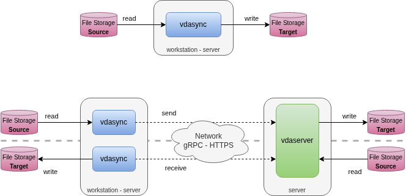
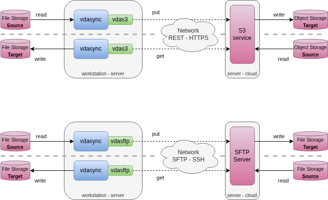

# vdasync

Vdasync is a versatile data access and synchronization tool,
providing access to local files, to remote files,
and integrating with various data access means through the use of plugins.

## General

Vdasync synchronization tool is a [CLI](https://en.wikipedia.org/wiki/Command-line_interface)
running on Go [supported platforms](https://go.dev/wiki/MinimumRequirements).

`vdasync` is intended to be used for backups and data replication.
Beyond local and remote files access, synchronization may leverage other data access means through plugins.
`vdasync` also adds the capability to track long-running synchronization operations on large datasets
through the use of operations logs.

It leverages Go [concurrency features](https://go.dev/wiki/LearnConcurrency)
to enable the use of available resources as efficiently as wanted.

It comes with the following components:

- [vdasync](docs/vdasync.md), the synchronization CLI,
- [vdaserver](docs/vdaserver.md), a [gRPC](https://grpc.io/) server providing remote access to files,
- [vdaservice](docs/vdaservice.md), a CLI mainly used for operations, administration and testing purposes,
- a gRPC plugin API to add other data access means, among which the following are provided:

  - [vdas3](docs/vdas3.md), storing data as S3 storage objects,
  - [vdasftp](docs/vdasftp.md), accessing files available on a SFTP server,
  - [vdaencrypt](docs/vdaencrypt.md), storing encrypted data on local or remote files,

The following additional components are also provided:

  - [vdatserver](docs/vdatserver.md), is a gRPC server providing shared access to encrypted files
  - [vdasftpsync](docs/vdasftpsync.md), a convenience utility that integrates the `vdasftp` plugin inside `vdasync`
  - [testcerts](docs/tls.md) a generator for testing certificates and their authorities

## Deployment overview

The schema below illustrates how `vdasync` synchronizes
local or remote files in a standalone or client-server deployment.

Even if not illustrated, nothing prevents `vdasync` to synchronize remote files among themselves,
at the cost of related data transfers on the network.

Using cloud or network storage services such as S3 object storage or SFTP
is enabled with plugins as shown below:

Plugins are gRPC servers running on the same host as the `vdasync` command, which automatically start and stop them.
They use the same API as `vdaserver` which makes the latter identical to a plugin implementing access to local files
and running on a remote host. By the way, such a plugin, named `localFiles`, is provided for testing purpose.

Again, while not illustrated, data synchronization between plugins and remote files is also possible,
as well as between plugins themselves.

## Basic usage

Basic usage is

    vdasync [-dryrun] [-rm] [-check] -source <source DSS> -target <target DSS>

DSS stands for data storage system:
this can refer either to local files, to remote files accessed on a host running `vdaserver`,
or else to a plugin configured through a file.
Use `vdasync -help` to display the flags and their meanings.
See the dedicated [page](docs/vdasync.md) for detailed information.

Source and target directories must exist in the case of files, their respective sub-trees will be synchronized.

For instance

    vdasync -dryrun -rm -source /path/to/dev -target /path/to/backup/for/dev
    vdasync -rm -source /path/to/dev -target /path/to/backup/for/dev
    vdasync -dryrun -check -source /path/to/dev -target /path/to/backup/for/dev

Remote access to a `vdaserver` would be enabled with the following [DSS syntax](docs/dssurl.md):

    dss://<server>:<port>/path/to/remote

For instance restoring local files from a remote backup:

    vdasync -rm -source dss://backup-server:9443/path/to/backup -target /path/to/dev

## Detailed information

Vdasync commands and their arguments are detailed here:

- [vdasync](docs/vdasync.md)
- [vdaserver](docs/vdaserver.md)
- [vdaservice](docs/vdaservice.md)

Vdasync plugins are detailed here:

- [vdas3](docs/vdas3.md), storing data as S3 storage objects,
- [vdasftp](docs/vdasftp.md), accessing files available from on a SFTP server,
- [vdaencrypt](docs/vdaencrypt.md), storing encrypted data on local or remote files,

Vdasync technical details are following:

- [DSS syntax](docs/dssurl.md)
- [vdasync's configuration](docs/conf.md)
- [TLS configuration](docs/tls.md)
- [Development](docs/dev.md)

## Limitations

- The native or plugin-based DSS implementations are not able to handle special files
(sockets, pipes, devices...) other than symbolic links.
This is notified as an error by the API, and in the case of the synchronization CLI
may be ignored using explicit exclusion lists or implicitly with the `-iirreg` flag.
- While a DSS implementation can provide some horizontal scalability through distributed processing or storage,
this is (currently) not the case for the synchronization engine itself.
Even if the memory used by the `vdasync` process remains moderated on very large datasets
through the use of operation logs,
such a limitation could be a concern when DSS implementations provide high I/O rates that cannot be fully leveraged
by the actual data copy performed by `vdasync` itself.

## Status

Vdasync is actively tested on Linux amd64 and tested on Windows amd64.