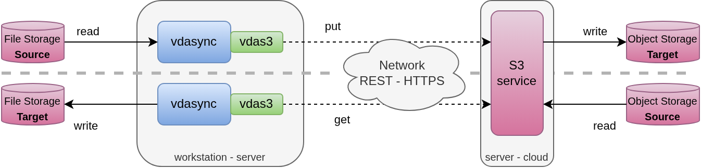

# vdas3 plugin

This plugin stores data and related metadata (directory contents, files attributes)
as S3 object.

## Usage

Plugin is `vdas3` and its arguments can be found with `vdas3 -help`. Main arguments are:

    -s3bucket string
        aws s3 bucket name
    -s3prefix string
        aws s3 prefix in the bucket
    -s3profile string
        aws config profile name, default if not specified
    -s3purge
        don't run the plugin, clean up all s3 objects under the given prefix

### Configuration sample

The following configuration

    pluginsOptions:
      clientCertPath: /path/to/client_cert
      clientKeyPath: /path/to/client_key
      certPath: /path/to/plugin_cert
      keyPath: /path/to/plugin_key
      caCertPath: /path/to/ca_cert
    plugins:
    - name: s3_sample
      type: vdas3
      addArgs:
    - "-s3bucket"
    - test-bucket
    - "-s3prefix"
    - vdasync/s3_sample_prefix
    - "-s3profile"
    - test-profile

would be leveraged by vdasync/vdaservice with DSS URL:

    s3_sample+dss:/path/to/data_file

## Limitations and restrictions

### Scalability and reliability

It is a "simple" tool because local files attributes and directories content are globally

- loaded in plugin memory during data access
- stored in a single S3 object created at the end of the synchronization, keeping previous versions as backup

Such metadata handling has limitations both in terms of scalability (could handle 100k files but not 10 millions),
and reliability (metadata global file update can fail after numerous encrypted data files updates).
The second point is generally not a big concern as synchronization can be run as many times as wanted until it succeeds.

However, such errors can leave unreferenced data files that would require periodic clean-up. Such a tool is yet to be implemented.

