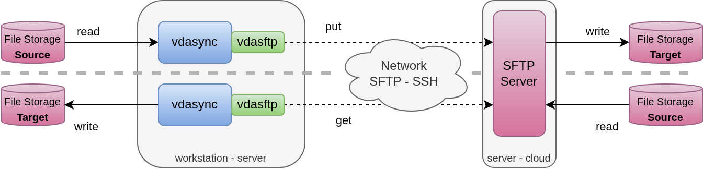

# vdasftp plugin

This plugin is a SFTP client that provides access to files available on a SFTP server.

See also the [`vdasftpsync`](vdasftpsync.md) CLI for simpler integration.

To be completed.

## Usage

    Usage of vdasftp:
    -ca string
            server or plugin TLS CA certificate
    -cert string
            server or plugin TLS certificate
    -clientca string
            client TLS CA certificate
    -clientcert string
            client TLS certificate
    -clientkey string
            client TLS certificate key
    -conc int
            number of concurrent activities
    -config string
            configuration file, see documentation
    -host string
            host/address to listen, defaults to localhost (default "localhost")
    -insec
            don't check certificate when communicating with server
    -insecplugin
            don't check certificate when communicating with plugins
    -key string
            server or plugin TLS certificate key
    -level string
            log level, defaults to ERROR
    -log string
            log file, defaults to vdasync-<pid>.log in temp dir, "std[out|err]" are known keywords
    -name string
            plugin name
    -notls
            insecure communication with servers over http
    -notlsplugin
            insecure communication with plugins over http
    -out string
            file for output, defaults to stdout, "std[out|err]" are known keywords (default "stdout")
    -port int
            port to listen
    -sftpaddress string
            SFTP server address, defaults to localhost:22 (default "localhost:22")
    -sftpident string
            SSH identity file to authenticate
    -sftproot string
            root path from SFTP server root where files are served
    -sftpuser string
            SFTP server login
    -silent
            no output, or simple summary in case also verbose
    -type string
            plugin type
    -verbose
            detailed output
    -version
    